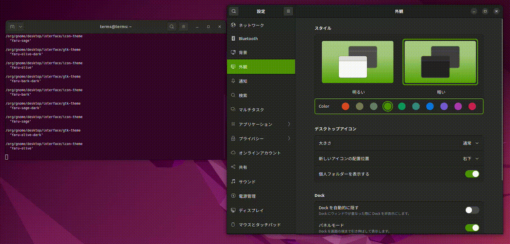
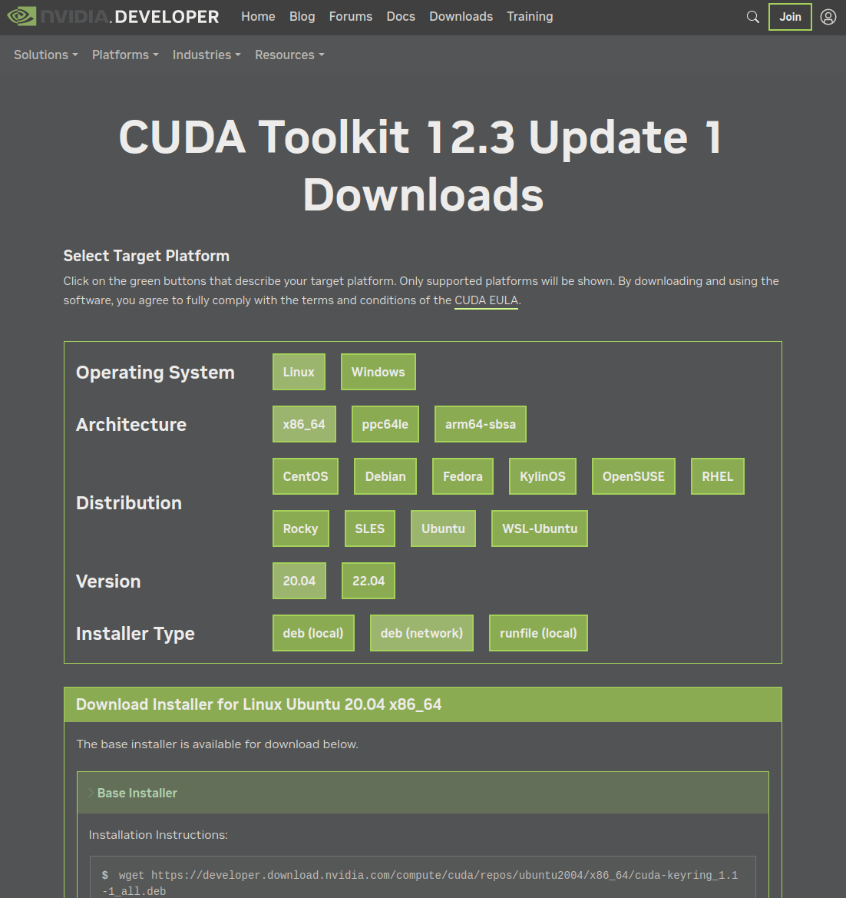

# システム再インストールを楽にする手順: 専用BashScriptのすすめ


## はじめに
Ubuntuは2年おきにLTS(Long Term Support)版がリリースされます。
わたしは最新版のLTS版がリリースされてから十分な期間を経て、その前のバージョンのLTS版をシステムとして導入しています。たとえば、現在Ubuntu 22.04が最新版であり、まもなく24.04がリリースされるタイミングです。ですので今回のシステム入れ替えは20.04から22.04へのアップグレードとなります。

さて、ネット上には「〇〇をインストールしたらやること10か条」というような記事が多くあります。
それらはだいたい同じことが書いてある傾向があり、それをすべて手作業でおこなっています。

一方でAnsibleのような「大規模なインフラストラクチャの管理」に使われるツールがありますが、1台のPCのためにそれを使うのはオーバーキルです。

そこで簡単なBashScriptを書いて、それを実行するだけでシステムを再インストールできるようにしています。
随分前からこの方法を使っていますが、大きな障害もなく使えています。

## スクリプト構成
スクリプトは以下の3つに分かれています。
- ins.sh: インストール時に必須のパッケージをダウンロードしたり、他のスクリプトを実行したりします。
- apt_install_list.sh: aptでインストールするパッケージのリストです。
- copy_dot_files.sh: ホームディレクトリにコピーするドットファイルのリストです。

:: note ::
これらスクリプトの中にはシステム固有の情報がハードコーティングされているため、ここでは公開できる部分に絞って掲載します。

### ins.sh
コメントに説明が書いてありますので、それぞれ参照いただくとして、説明が必要な部分を解説します。

https://github.com/yKesamaru/reinstall_system/blob/dcbf24f9259d4ea040d3f8dd2c4bdf8cda1868b9/ins.sh#L1-L169

#### 作業環境の設定
この部分ではユーザー体験に直接関わる設定をおこなっています。
`gsettings`コマンドを使用することにより、使い慣れたUIやキーバインド、各種設定を再現します。

これらをご自身の環境で再現する場合、`dconf watch /`コマンドを使い、設定を変更したときに出力されるコマンドを参考にすると良いでしょう。



### apt_install_list.sh
こちらも説明が必要な部分のみ解説します。
#### Nvidia ドライバーとCUDAライブラリのインストール
この部分のみ、Ubuntuのバージョンによってインストールするパッケージが異なります。
```bash
wget https://developer.download.nvidia.com/compute/cuda/repos/ubuntu2204/x86_64/cuda-keyring_1.1-1_all.deb
```
このURLは以下のページから取得してください。
[CUDA Toolkit 12.3 Update 1 Downloads](https://developer.nvidia.com/cuda-downloads?target_os=Linux&target_arch=x86_64&Distribution=Ubuntu&target_version=20.04&target_type=deb_network)



### VS Code
ここではマイクロソフトのリポジトリから取得していますが、snapでもインストールできます。その場合は以下のようになります。ただし以前snapバージョンでは日本語の取り回しに難があったため、わたしはdebパッケージを使用しています。
```bash
snap install code
```
Flatpakでインストールするには以下の手順に沿います。
```bash
sudo apt install flatpak
flatpak remote-add --if-not-exists flathub https://flathub.org/repo/flathub.flatpakrepo
flatpak install flathub com.visualstudio.code
```
